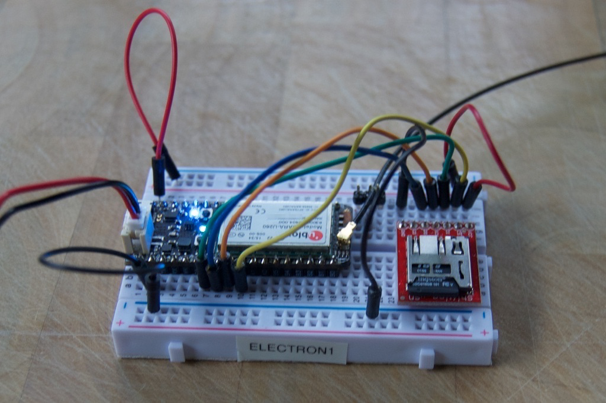

# SD Firmware Flash Example

*Flas firmware to a Particle Electron or Photon from an SD flash card*

This is a simple example program that allows flashing system and/or user firmware on a Photon or Electron using an SD card. 

You'll need an SD card breakout adapter, like one from [SparkFun] (https://www.sparkfun.com/products/13743) or [Adafruit] (https://www.adafruit.com/products/254) and a MicroSD card. 



```
SD Adapter   Electron
SS (CS)      A2
SCK          A3
MISO (DO)    A4
MOSI (DI)    A5
```

You'll need to use the program here, or more likely integrate the code into your application. You'll also need to use the [SDFAT library] (https://github.com/greiman/SdFat-Particle) which is also in the Particle Community Libraries as "SDFAT."

To use it, put these files at the top level of the SD card:

```
system1.bin
system2.bin
system3.bin
firmware.bin
```

The files must have exactly these names, not the names of the files you downloaded.

If you're only flashing user firmware, you can omit the system files. If you're using system firmware 0.5.3 or earlier (or using this on a Photon), there will only be two system parts.

The program uses retained memory to keep track of what stage you've downloaded to. It checks every 30 seconds. If you remove the card for a cycle, it will reload the files again when you reinsert the card.


